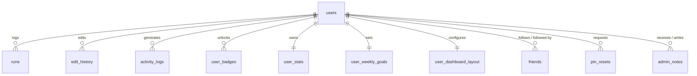

# RunRush Project Summary

This document provides a comprehensive overview of the RunRush project, its architecture, technology stack, features, and database schema, based on the current state of the codebase.

---

## 1. Project Overview

**What RunRush is:**
RunRush is a web-based fitness tracking application specifically designed for runners. It provides a centralized dashboard for users to log, visualize, and analyze their running activities.

**Target Users:**
Runners of all levels looking for an interactive, gamified, and data-rich way to track their progress, view running heatmaps, earn achievements, and engage with a social leaderboard.

**Core Problem Solved:**
Many running apps are heavily mobile-focused and locked into closed ecosystems. RunRush solves the problem of manual tracking and fragmented data by offering multiple ingestion methods (manual entry, Strava CSV import, AI screenshot parsing), robust analytics, ML-driven run predictions, and an engaging web dashboard. 

**Current State:**
The project is a fully functional MVP with production capabilities. It includes authentication, role-based access control (Admin/User), ML models for predictive insights, a highly customizable drag-and-drop widget dashboard, social following mechanics, and a robust badge/achievement system.

---

## 2. Tech Stack

### Backend
*   **Python (v3.x):** Core language.
*   **Flask:** The lightweight web framework powering the HTTP server, routing, and API.
*   **Jinja2:** HTML templating engine used to render server-side UI views.
*   **psycopg2-binary / sqlite3:** Database drivers. The app dynamically wraps SQLite for local ephemeral dev/Render hosting, and PostgreSQL for persistent production hosting (`db.py`).

### Frontend
*   **Vanilla JavaScript (ES6+):** Used for client-side API calls (`fetch`), DOM manipulation, and dynamic dashboard widget rendering.
*   **Bootstrap 5:** Primary CSS framework used for layout grids, responsive design, modals, and generic UI components.
*   **SortableJS:** Enables the drag-and-drop, reorderable widget layout on the main dashboard.
*   **Chart.js:** Used for rendering analytics charts (pace trends, etc.).
*   **Leaflet.js:** Used for rendering the interactive running Heatmap on the dashboard.
*   **FontAwesome (via CDN):** Used for UI iconography.

### Database & Storage
*   **SQLite (Local/Ephemeral) & PostgreSQL (Production):** A unified abstraction layer (`db.py`) allows the app to run on both database systems seamlessly using `conn.execute()` and `fetchall()`. 

### AI & Machine Learning
*   **Google GenAI API (`google-genai`):** Used to parse images (e.g., screenshots of smartwatch or treadmill displays) to automatically extract run data (distance, time, pace).
*   **Scikit-Learn / Pandas / Numpy (`ml_predictor.py`):** Used to power the predictive analytics feature (`/api/predict-next-run`), forecasting a user's next run performance based on their historical training data.

### Authentication & Security
*   **Custom PIN Auth:** Primary login mechanism uses a Username + 6-digit PIN (hashed via `werkzeug.security`).
*   **Authlib / Google OAuth:** Allows users to link and log in via Google accounts.
*   **Flask-Limiter:** Used for rate-limiting sensitive routes (e.g., PIN recovery).

---

## 3. Project Structure

```text
RunRush/
├── app.py                      # Main entry point. Defines all Flask routes and server logic.
├── db.py                       # Unified DB abstraction layer (wraps SQLite & psycopg2).
├── ml_predictor.py             # Machine learning pipeline for run pace/distance predictions.
├── config.py                   # Configuration environment loader.
├── extensions.py               # Flask extensions (blinker, limits).
├── requirements.txt            # Production dependencies.
├── .env                        # Environment variables (API keys, DATABASE_URL).
│
├── services/                   # Core business logic separated from HTTP routes.
│   ├── auth_service.py         # Google OAuth and session management.
│   ├── badge_service.py        # Badge definition dictionary and badge granting logic.
│   ├── pin_recovery_service.py # Logic for email-based PIN resets.
│   ├── run_service.py          # Run insertion, pace calculation, and CSV parsing.
│   ├── streak_service.py       # Logic for calculating running streaks.
│   └── weather_service.py      # Weather API integration.
│
├── templates/                  # Jinja2 HTML Views.
│   ├── index.html              # The main dashboard with drag-and-drop widgets.
│   ├── landing.html            # Public marketing homepage.
│   ├── login.html              # Login portal.
│   ├── register.html           # User registration portal.
│   ├── leaderboard.html        # Public runner rankings.
│   ├── social.html             # Social feed of friends' activities.
│   ├── admin.html              # Admin dashboard.
│   └── settings.html           # User configuration.
│
├── static/                     # (Implied) Static assets, CSS, images.
├── scripts/                    # Maintenance and testing scripts.
├── migrations/                 # DB migration scripts for schema updates.
└── tests/                      # Automated test suite.
```

---

## 4. Application Architecture

RunRush utilizes a monolithic architecture with server-side rendering, enhanced by asynchronous client-side API calls.

1.  **Client Tier (Browser):** Renders Jinja2 templates. Much of the dashboard is dynamically hydrated using JavaScript `fetch` calls to internal API endpoints.
2.  **Routing Tier (`app.py`):** Flask handles incoming HTTP requests, enforces `require_login()` session checks, and routes API requests.
3.  **Service Tier (`services/`):** Business logic is decoupled from routing. E.g., when a run is added, `app.py` calls `run_service.py` to calculate pace, which then calls `streak_service.py` and `badge_service.py` to update user progress.
4.  **Data Access Tier (`db.py`):** Intercepts raw SQL queries and routes them to either `sqlite3` or `psycopg2` based on the environment configuration, standardizing the return payload to a dictionary-like row format.
5.  **Database:** Persistent storage for user records, run metrics, and system metadata.

---

## 5. Pages & Routes

### Views (HTML)
*   `/` - Landing page (marketing) or redirects to `/dashboard` if logged in.
*   `/dashboard` - The main user dashboard. Contains the heatmap, recent runs, widgets, and Quick Start logging.
*   `/login`, `/register`, `/onboarding` - Authentication and setup flows.
*   `/forgot-pin`, `/forgot-pin/*` - PIN recovery flows.
*   `/settings` - User configuration (theme, location, connected accounts, data wipe).
*   `/leaderboard` - Global leaderboard displaying top users by distance/streak.
*   `/social-feed` - Activity feed of followed users.
*   `/admin` - Superuser panel to view logs, edit user data, and clean spam.
*   `/offline` - PWA offline fallback page.

### Internal API Endpoints (JSON)
*   `/add` (POST) - Logs a new manual run.
*   `/edit/<run_id>`, `/delete/<run_id>` - Run modifications.
*   `/api/parse-import` (POST) - Parses uploaded Strava CSVs.
*   `/api/parse-screenshot` (POST) - Sends image to Google GenAI for OCR run data extraction.
*   `/api/heatmap-data` (GET) - Returns GeoJSON/Coordinate data for Leaflet maps.
*   `/api/predict-next-run` (GET) - Returns scikit-learn ML predictions for the user.
*   `/api/badges`, `/api/badges/progress` (GET) - Returns user achievement states.
*   `/api/dashboard-layout` (GET/POST) - Fetches or saves the SortableJS widget layout.
*   `/api/sync-run` (POST) - API for 3rd party sync.
*   `/follow/<username>`, `/unfollow/<username>` (POST) - Social interaction triggers.

---

## 6. Major Features

*   **Dashboard & Widget System:** A highly customizable dashboard utilizing SortableJS. Users can drag, drop, hide, and reorder widgets (Heatmap, Activity, Progress, Quick Start) to fit their preference. Layouts are saved in the DB.
*   **Run Tracking & Analytics:** Logs runs (Date, Distance, Time) and auto-calculates Pace and Calories. Features a dedicated ML service (`ml_predictor.py`) to forecast future performance.
*   **Multiple Ingestion Methods:** 
    *   Manual entry form.
    *   Strava CSV Import parser.
    *   AI Screenshot Parsing (Users upload a photo of a treadmill/watch, and Google GenAI extracts the metrics).
*   **Achievements & Badges:** A robust gamification system. Users earn badges (e.g., "First 5K", "7-Day Streak") automatically when logging runs. Badges are displayed in a dedicated widget and tab.
*   **Social & Leaderboard:** Users can search for and follow other runners. A global leaderboard ranks users by total distance and current streak. A social feed displays friends' activities.
*   **Weather Integration:** Automatically logs local weather conditions (temp, humidity, emoji) during a run if the user has a location set.
*   **Admin Panel:** Role-based dashboard (`role='admin'`) allowing moderation, viewing system logs, and leaving admin notes on users.

---

## 7. Database

**Provider:** Dual support for SQLite (development/ephemeral) and PostgreSQL (production).

### Schema Overview



### Tables

1.  **`users`**: Core identity table.
    *   `id` (PK), `username` (UNIQUE), `pin` (Hashed), `display_name`, `weight`, `height`, `weekly_goal_km`, `theme`, `role`, `status`, `email`, `google_id` (UNIQUE), `recovery_email`, `home_city`, `home_latitude`, `home_longitude`.
2.  **`runs`**: Individual logged activities.
    *   `id` (PK), `user_id` (FK), `date`, `distance_km`, `time_min`, `pace`, `calories`, `run_type`, `insight`, `notes`, `weather_temp`, `weather_humidity`, `weather_wind_kph`, `weather_condition`, `weather_emoji`.
3.  **`user_stats`**: Aggregated running statistics (updated via triggers/service logic).
    *   `id` (PK), `user_id` (FK UNIQUE), `total_distance_km`, `current_streak`, `best_streak`, `last_activity_date`.
4.  **`user_badges`**: Tracks which users have earned which achievements.
    *   `id` (PK), `user_id` (FK), `badge_key` (TEXT), `unlocked_at`, `activity_id`.
    *   Constraint: `UNIQUE(user_id, badge_key)`.
5.  **`user_dashboard_layout`**: Stores the user's custom SortableJS widget arrangement.
    *   `user_id` (PK/FK), `layout_json`.
6.  **`friends`**: Social following relationships.
    *   `id` (PK), `follower_id` (FK), `followed_id` (FK).
    *   Constraint: `UNIQUE(follower_id, followed_id)`.
7.  **`activity_logs`**: System audit trail.
    *   `id` (PK), `user_id` (FK), `action`, `details`, `timestamp`.
8.  **`edit_history`**: Audit trail for modified run records.
    *   `id` (PK), `run_id` (FK), `user_id` (FK), `field_name`, `old_value`, `new_value`.
9.  **`pin_resets`**: Recovery tokens.
    *   `id` (PK), `user_id` (FK), `code_hash`, `expires_at`, `used_at`.
10. **`user_weekly_goals`**: Overrides default weekly goals.
    *   `user_id` (PK/FK), `goal_km`.
11. **`admin_notes`**: Moderation notes left by admins on users.
    *   `id` (PK), `target_user_id` (FK), `author_id` (FK), `note`.
12. **`badges`**: (Legacy/Metadata table).
    *   `id` (PK), `key` (UNIQUE), `name`, `description`, `icon_url`, `criteria_type`, `criteria_value`. *(Note: The application primarily relies on a hardcoded `BADGE_METADATA` dictionary in `badge_service.py` for modern operations).*
