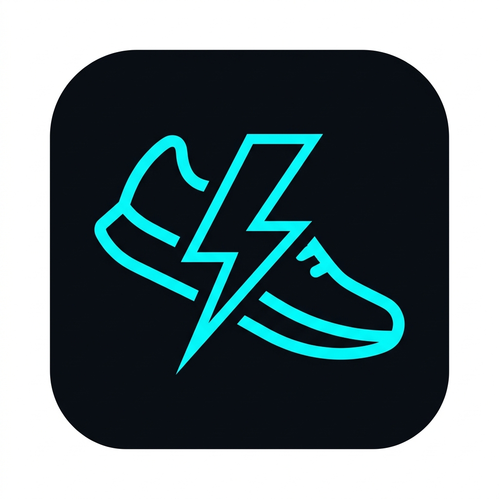
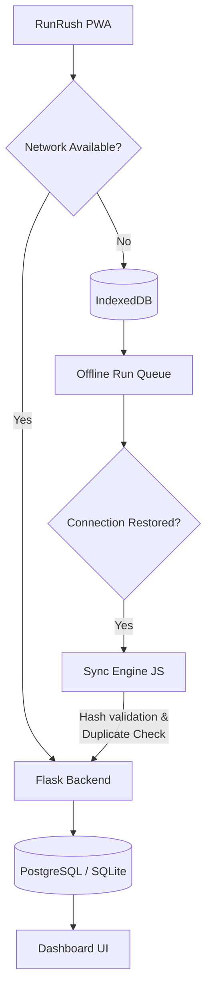
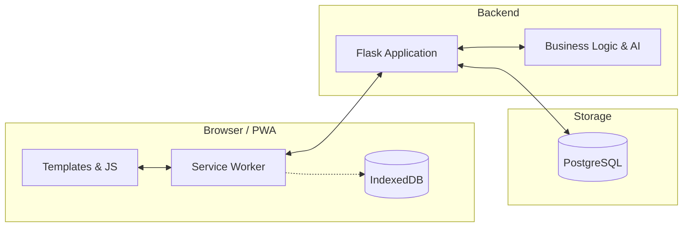

<div align="center">
  
  <h1>RunRush</h1>
  <p><strong>Track. Improve. Repeat.</strong></p>
  <p>A modern, offline-first Progressive Web Application (PWA) for runners who mean business.</p>
  
  <p>
    
    
    
    
    
  </p>
</div>

---

## 🏃 About RunRush

RunRush is more than a standard CRUD application—it is a production-minded, offline-capable fitness platform engineered for high performance and reliability. 

Designed for runners who need their tools to work anywhere—even on a remote trail with zero cellular coverage—RunRush leverages a robust **Progressive Web App (PWA)** architecture to deliver a native-like experience directly in the browser. 

Whether you are aiming for a new 5K personal best, maintaining a daily running streak, or bulk-importing historical data, RunRush is designed to keep you moving forward.

---

## ✨ Features

### 🏃 Running & Analytics
* **Advanced Activity Tracking:** Record distance, duration, pace, and estimated calories burned.
* **Strava CSV Bulk Import:** Multi-stage preview, duplicate detection, and batch transaction rollback for seamless data migration.
* **AI Run Insights:** Intelligent feedback generated on every run based on your performance metrics.
* **Weather Integration:** Automatically logs weather conditions during your run (if location is provided).

### 📊 Progress & Gamification
* **Comprehensive Dashboard:** Interactive charts (via Chart.js), calendar heatmaps, and milestone rings (5k, 10k, Half/Full Marathon).
* **Streaks & Goals:** Weekly goal progress tracking and daily streak maintenance.
* **Achievements System:** Unlockable badges and milestone rewards based on your running history.
* **Global Leaderboards & Social:** Compare weekly stats, view podiums, and mention friends in your run notes.

### 📱 PWA & Offline Experience
* **Installable:** Add directly to your iOS/Android home screen for a standalone, app-like experience.
* **Offline Run Logging:** Log runs securely to **IndexedDB** when completely disconnected from the internet.
* **Automatic Synchronization:** A dedicated background sync engine automatically detects when connectivity is restored and safely pushes queued runs to the server using robust duplicate detection.
* **Cache-First Assets:** Near-instant load times via Service Worker caching.

### 🔐 User Experience & Security
* **Authentication & Profiles:** Secure login, personalized dashboards, and height/weight configuration for accurate calorie estimates.
* **Admin Dashboard:** Dedicated interface for managing users and platform statistics.
* **Dark-Themed UI:** A beautiful, responsive, neon-accented dark mode built with custom glassmorphism styling and Bootstrap.

---

## 🔥 The PWA & Offline-First Architecture

RunRush guarantees that you can log a run regardless of your network status. It achieves this by intercepting network requests via a Service Worker and utilizing local IndexedDB storage.



### Architecture Highlights:
* **Service Worker (`sw.js`):** 
  * **Cache-First:** Core assets (CSS, JS, Fonts, Icons) are served instantly from the cache.
  * **Network-First:** HTML templates ensure you always see the latest dashboard if online, falling back to cache if offline.
* **Offline Fallback Page:** If a page is entirely uncached and the user is offline, a dedicated `/offline` route intercepts the request, providing a native UI to log the run locally.
* **Data Integrity:** The `/api/sync-run` endpoint utilizes SHA-256 hash verification and strict duplicate detection to prevent data corruption during synchronization recovery.

---

## 🏗️ System Architecture



---

## 🛠️ Tech Stack

| Layer | Technology |
| :--- | :--- |
| **Backend** | Python 3, Flask, Werkzeug |
| **Frontend** | HTML5, CSS3, JavaScript (Vanilla), Bootstrap 5.3.2 |
| **Database** | PostgreSQL (Production) / SQLite (Local Development) |
| **Offline Storage** | IndexedDB, Web Storage API |
| **PWA** | Web App Manifest, Service Worker Cache API |
| **Data Viz** | Chart.js |
| **Deployment** | Gunicorn (WSGI) |

---

## 📂 Project Structure

```text
RunRush/
├── app.py                  # Main Flask application entry point
├── blueprints/             # Modularized Flask routes (auth, admin, api, etc.)
├── models/                 # Database models and schema definition
├── services/               # Core business logic (weather, AI insights, badges)
├── static/                 
│   ├── css/                # Custom styling (landing.css, etc.)
│   ├── js/                 # Sync engine, offline storage, PWA registration
│   ├── icons/              # PWA app icons (192x192, 512x512)
│   ├── manifest.json       # Web App Manifest
│   └── sw.js               # Service Worker implementation
├── templates/              # Jinja2 HTML templates
├── requirements.txt        # Python dependencies
└── README.md
```

---

## 📱 Installation (PWA)

RunRush behaves exactly like a native app when installed on your mobile device.

* **Android (Chrome):** Open RunRush, tap the prompt banner at the bottom of the screen, or tap the three-dot menu and select "Install app".
* **iOS (Safari):** Open RunRush, tap the Share icon, scroll down, and tap "Add to Home Screen".
* **Desktop (Chrome/Edge):** Click the install icon in the URL address bar.

---

## 💻 Local Development

RunRush is designed to be easy to spin up locally using SQLite.

**1. Clone the repository:**
```bash
git clone https://github.com/Yajat-Sharma/Runrush.git
cd Runrush
```

**2. Create a virtual environment and install dependencies:**
```bash
python -m venv venv
# Windows
venv\Scripts\activate
# macOS/Linux
source venv/bin/activate

pip install -r requirements.txt
```

**3. Run the application:**
```bash
python app.py
```
The application will be available at `http://localhost:5000`. By default, it will create a local `runs.db` SQLite file.

---

## 🌍 Deployment

RunRush is configured for production deployment on modern platforms like Render.

* **Web Server:** Gunicorn is utilized as the production WSGI HTTP Server.
* **Database Migration:** The application includes a `migrate_to_pg.py` script to safely transition from a local SQLite database to a production PostgreSQL instance.
* **Persistence:** Because platforms like Render use ephemeral filesystems, a PostgreSQL instance must be provisioned and connected via the `DATABASE_URL` environment variable to ensure data persistence across deployments.

---

## 🔒 Security & Reliability

* **Password Hashing:** Passwords are never stored in plaintext (handled via secure hashing libraries).
* **Route Protection:** Decorators (e.g., `require_login`) ensure protected routes and API endpoints reject unauthorized access with `401/403` responses.
* **Input Validation:** Backend validation protects against malformed run data (e.g., preventing future-dated runs or impossible pacing).
* **Data Integrity:** CSV bulk imports process within a database transaction, automatically rolling back if validation fails, while background offline syncing utilizes payload hashing to prevent tampering or duplicates.

---

## 🗺️ Roadmap

### ✅ Completed
* Core run tracking & analytics
* Offline-first PWA architecture & background sync
* Global leaderboards & social feeds
* Strava bulk CSV import
* AI run insights & weather integration
* Gamification (Streaks & Badges)

### 🚧 Planned
* Advanced training plans
* Direct OAuth integration with Strava/Garmin
* Granular heart-rate zone analysis
* Weekly team challenges

---

## 🤝 Contributing

Contributions are welcome! Please follow standard Git workflow:

1. Fork the repository
2. Create a feature branch (`git checkout -b feature/amazing-feature`)
3. Commit your changes (`git commit -m 'Add amazing feature'`)
4. Push to the branch (`git push origin feature/amazing-feature`)
5. Open a Pull Request

---

<div align="center">
  <p>Built with ⚡ by <strong>Yajat Sharma</strong></p>
</div>
